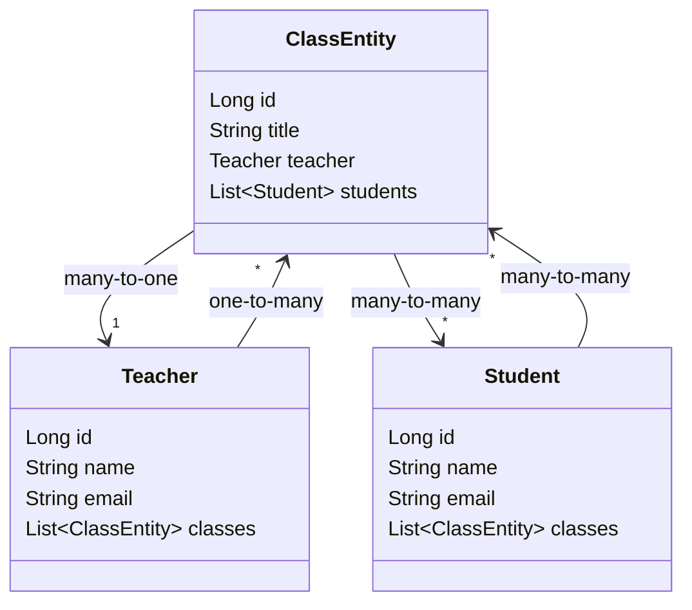
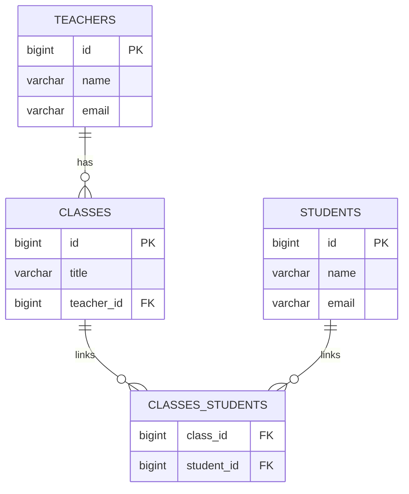

# quarkus-panache-crud-example
for the database
```linux
docker run --name quarkus-pg -e POSTGRES_USER=democrud -e POSTGRES_PASSWORD=democrud -e POSTGRES_DB=schooldb -p 5432:5432 -d postgres:15
```


This project uses Quarkus, the Supersonic Subatomic Java Framework.

If you want to learn more about Quarkus, please visit its website: <https://quarkus.io/>.

## Running the application in dev mode

You can run your application in dev mode that enables live coding using:

```shell script
./gradlew quarkusDev
```

> **_NOTE:_**  Quarkus now ships with a Dev UI, which is available in dev mode only at <http://localhost:8080/q/dev/>.

## Packaging and running the application

The application can be packaged using:

```shell script
./gradlew build
```

It produces the `quarkus-run.jar` file in the `build/quarkus-app/` directory.
Be aware that it’s not an _über-jar_ as the dependencies are copied into the `build/quarkus-app/lib/` directory.

The application is now runnable using `java -jar build/quarkus-app/quarkus-run.jar`.

If you want to build an _über-jar_, execute the following command:

```shell script
./gradlew build -Dquarkus.package.jar.type=uber-jar
```

The application, packaged as an _über-jar_, is now runnable using `java -jar build/*-runner.jar`.

## Creating a native executable

You can create a native executable using:

```shell script
./gradlew build -Dquarkus.native.enabled=true
```

Or, if you don't have GraalVM installed, you can run the native executable build in a container using:

```shell script
./gradlew build -Dquarkus.native.enabled=true -Dquarkus.native.container-build=true
```

You can then execute your native executable with: `./build/quarkus-panache-crud-example-1.0.0-SNAPSHOT-runner`

If you want to learn more about building native executables, please consult <https://quarkus.io/guides/gradle-tooling>.

## Related Guides

- Hibernate ORM with Panache ([guide](https://quarkus.io/guides/hibernate-orm-panache)): Simplify your persistence code for Hibernate ORM via the active record or the repository pattern

## Provided Code

### Hibernate ORM

Create your first JPA entity

[Related guide section...](https://quarkus.io/guides/hibernate-orm)

[Related Hibernate with Panache section...](https://quarkus.io/guides/hibernate-orm-panache)




